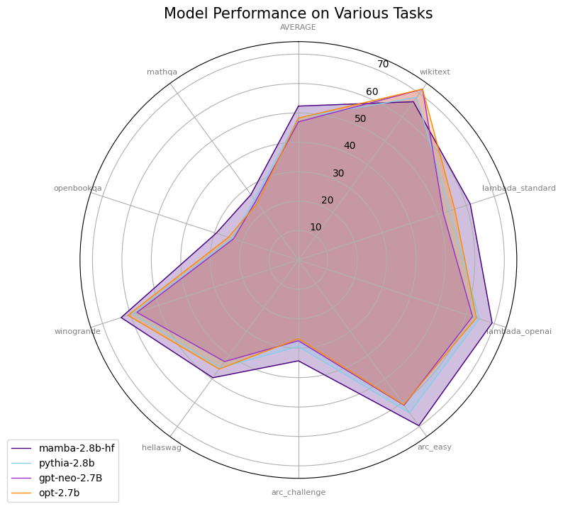
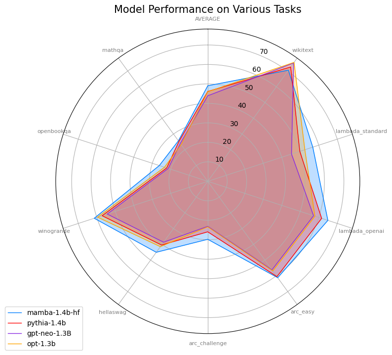

# CS5242 Project


## About

Our study focuses on Mamba, an emerging text generation model that integrates the strengths of the long-range perception capabilities and transformers to address the efficiency and effectiveness of sequence modeling. Mamba employs structured state space models (SSMs) to optimize prompt responses and enhance mathematical reasoning capabilities. Our experiments demonstrate that Mamba outperforms traditional transformer models in computational efficiency and reasoning tasks by effectively balancing correlation and causality within sequence data. We further enhance the Mamba's capabilities in mathematical reasoning by fine-tuning it. This successfully validates that fine-tuning methods based on Parameter Efficient Fine-Tuning (PEFT) can strengthen the model's performance in specific domains. The findings suggest that Mamba's selective model architecture, focusing on context-aware sequence modeling, can significantly improve performance in natural language processing tasks, particularly in mathematical reasoning and prompt optimization. This research advances our understanding of sequence model architectures and sets a foundation for future explorations into efficient and effective language modeling.

## Installation

- mamba-ssm 1.2.0
- transformers 4.39.1
- causal-conv1d 1.2.0.post2
- datasets 2.18.0
- lm_eval 0.4.2
- pandas 2.2.1
- PyTorch 1.12+
- CUDA 11.6+


## Experiments

### lm-evaluation-harness
```bash
python evals/lm_harness_eval.py --model hf --model_args pretrained=DreamOnRain/mamba-1.4b-msmath --tasks "${tasks}" --device cuda --batch_size 64
```

### fine-tune
```bash
python finetune/finetune.py
python finetune/merge.py
```

### mathematical reasoning
```bash
python benchmarks/benchmark_generation_mamba_simple.py --model-name "${model_list[0]}" --prompt "${prompt}"
```


## Results

### fine-tuned models
* [mamba-1.4b-msmath](https://huggingface.co/DreamOnRain/mamba-1.4b-msmath)
* [mamba-370m-msmath](https://huggingface.co/DreamOnRain/mamba-370m-msmath)
* [mamba-130m-msmath](https://huggingface.co/DreamOnRain/mamba-130m-msmath)

### Models Performance




## Reference

> **Mamba: Linear-Time Sequence Modeling with Selective State Spaces**\
> Albert Gu*, Tri Dao*\
> Paper: https://arxiv.org/abs/2312.00752


@article{mamba,
  title={Mamba: Linear-Time Sequence Modeling with Selective State Spaces},
  author={Gu, Albert and Dao, Tri},
  journal={arXiv preprint arXiv:2312.00752},
  year={2023}
}
